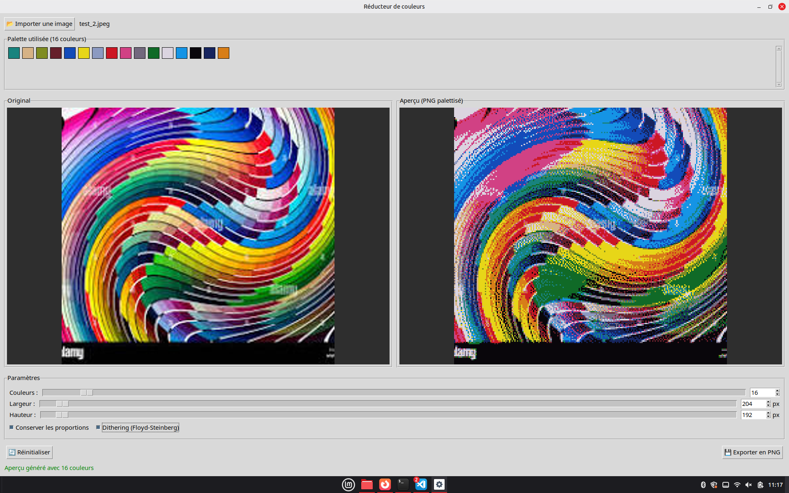

# Réducteur de couleurs

Application de bureau (Tkinter) pour réduire le nombre de couleurs d'une image
par quantification K-means, éditer la palette obtenue, et exporter le résultat
en PNG palettisé.



## Installation

```bash
pip install pillow numpy scikit-learn
```

## Lancer l'application

```bash
python3 app.py
```

## Utilisation

1. Importer une image (JPG, PNG, WEBP).
2. Ajuster le nombre de couleurs et les dimensions (largeur/hauteur en pixels)
   avec les sliders ou en tapant une valeur / en utilisant les flèches.
3. Cocher "Conserver les proportions" pour lier largeur et hauteur, ou la
   décocher pour les régler indépendamment (déformation possible).
4. Cocher "Dithering (Floyd-Steinberg)" pour diffuser l'erreur de
   quantification et réduire le banding.
5. L'aperçu et le panneau "Palette utilisée" (en haut de la fenêtre) se
   mettent à jour automatiquement. Les couleurs y sont triées par teinte
   puis luminosité.
6. Éditer la palette directement :
   - **clic gauche** sur une pastille : modifie la couleur (sélecteur teinte/
     saturation/luminosité avec pipette pour prélever une couleur dans l'image) ;
   - **clic droit** : supprime la couleur (il doit en rester au moins une) ;
   - **"+"** en fin de grille : ajoute une couleur.
   Toute édition manuelle fige la palette ; le bouton "🎲 Générer palette auto"
   l'abandonne et revient au calcul K-means automatique.
7. Exporter le résultat en PNG (une barre de progression s'affiche pendant
   l'export).

## Fichiers

- `app.py` — interface graphique Tkinter.
- `engine.py` — traitement d'image : palette K-means (triée par teinte/
  luminosité, ou fournie manuellement), quantification directe ou avec
  dithering Floyd-Steinberg (accéléré par une table de correspondance des
  couleurs), export PNG palettisé.
